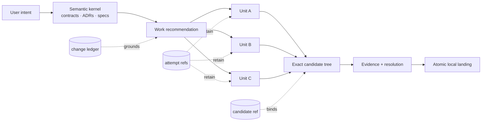

# Invariant

Govern the meaning. Parallelize the work. Land exact Git state.


Invariant turns a repository change into a visible work graph. The user supplies intent; the
semantic kernel finds the contracts, ADRs, and specs that govern it; execution can fan out across
independent units; and Git records the candidate, evidence, decisions, and landing.

| Layer | Owner or ground |
|---|---|
| **Intent** | User |
| **Resolution** | User, or a secondary agent holding one scoped `intent.resolve` capability |
| **Semantic kernel** | Normative contracts, ADRs, and specs accepted in the repository |
| **Lifecycle** | Git objects, refs, trees, evidence, and atomic ref movement |
| **Execution** | Parallel work within the kernel's current admissible graph |

## See the repository come online

```console
$ invariant init
INVARIANT  repository initialized
│
├─ intent       user
├─ resolution   secondary-agent
├─ execution    parallel work · auto transitions
├─ lifecycle    Git-grounded
└─ policy       .invariant/config.yml @ 8b1f3b924d0a
```

`init` creates **and commits** `.invariant/config.yml` as one isolated policy commit. You do not run
`git add`. Invariant blocks before writing if the repository has existing tracked edits; unrelated
untracked files are left alone.

The policy is tracked because authority must follow the repository—not the laptop, process, model,
or transcript that happens to be driving it:

```yaml
version: 1
authority:
  intent:
    suppliers: [user]
  resolution:
    delegation: secondary-agent
execution:
  transitions: auto
integration_branch: auto
publication: off
parallelism:
  maximum: auto
```

## A change is a Git graph



The kernel chooses a maximum safe frontier from declared and observed reach. A harness may run that
frontier concurrently, but it cannot inject an arbitrary plan. Attempts remain on Git refs, converge
into one exact tree, and land with compare-and-swap against the accepted base.

## Try a change

Install from the repository and initialize an existing Git project:

```bash
uv tool install git+https://github.com/RenderBear/invariant-cli.git
cd your-project
invariant init
```

Open intent and ask the kernel for the work graph:

```bash
invariant change open checkout-copy \
  --intent "Correct the checkout button copy" \
  --supplier user:alice \
  --path web/checkout/button.tsx

invariant change recommend checkout-copy
invariant change inspect checkout-copy
```

At any point, inspect the repository instead of reconstructing state from a conversation:

```bash
invariant status
invariant governance explain --path web/checkout/button.tsx
invariant change handoff checkout-copy
```

## Connect an agent harness

```bash
invariant-mcp --repository /absolute/path/to/repository
```

The repository-bound MCP gateway exposes typed operations for governance, recommendations, actions,
scoped capabilities, isolated work, convergence, evidence, landing, and publication. It does not
offer a generic shell or accept arbitrary Git arguments, paths outside the repository, remotes, or
credentials.

Execution capabilities cause one bounded effect. Resolution capabilities answer one bound semantic
question. A secondary agent may receive `intent.resolve`; that never gives it filesystem, shell,
ref, network, or publication access.

## What Git remembers

```text
.invariant/
├── config.yml                 authority and execution policy
├── records/
│   ├── semantic/              normative specs and ADR links
│   ├── domain/                ownership and dependency boundaries
│   ├── contract/              cross-domain promises
│   └── constraint/            closed operational consequences
├── SOURCES.yml
├── sources/
├── audits/
└── discoveries/

refs/invariant/changes/*       durable change ledgers
refs/invariant/work/*          retained isolated attempts
refs/invariant/candidates/*    exact aggregate candidates
```

Runtime directories, bearer tokens, transcripts, model choice, machine identity, containment
providers, and credentials remain host-local. Publication is off by default and, when enabled,
requires its own capability for the exact landed commit and existing upstream.

## Read further

- [CLI and MCP basics](docs/cli-basics.md)
- [Implementation design](docs/SPEC.md)
- [Protocol overview](protocol/README.md)
- [Normative protocol](protocol/protocol.md)
- [Human model](protocol/model.html)
