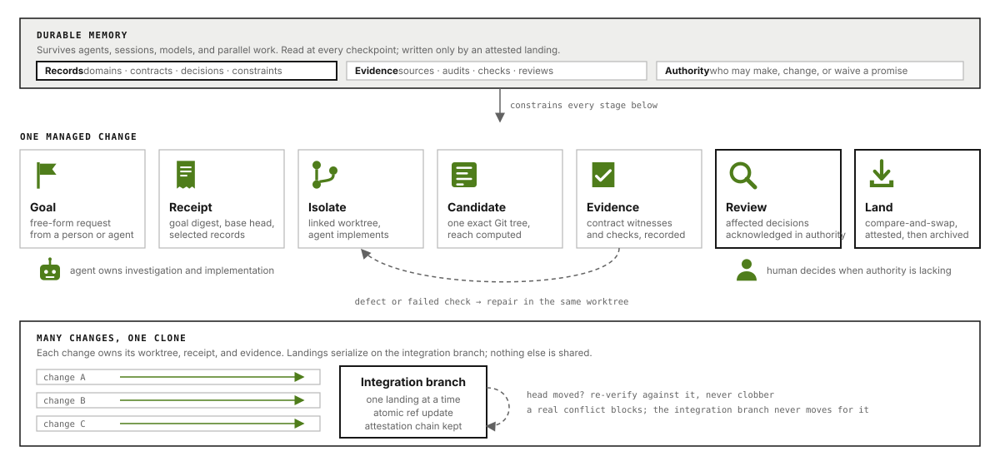

# Invariant: Durable semantic layer for agentic workflows

Invariant is a repository-native semantic control plane for coding agents and harnesses. Humans provide goals, resolve escalated
conflicts or ambiguity, and may control lifecycle transitions; agents handle repository internals. Within one local clone,
Invariant advances the integration branch only after exact-candidate verification succeeds and
keeps remote publication disabled by default. Its semantic records make review assertions
inspectable and attributable; they cannot prove that a reviewer reasoned sincerely.

It connects four critical axes for agentic work:

- **Governed autonomy** — stable architecture and executable contracts let agents act independently
  without weakening cross-domain promises.
- **Guided coordination** — temporary plans, dependencies, and ownership claims steer concurrent
  work through critical domains without becoming architecture.
- **Progressive or intensive discovery** — repositories can learn incrementally as work exposes
  missing context, or through a deliberate upfront audit. Findings remain evidence until resolved.
- **Git-grounded lifecycle** — isolated work, exact-candidate verification, and atomic local landing
  keep long-running changes stable and resumable.

Durable repository meaning is the semantic counterpart to temporal coordination: architecture and
contracts remain after the work ends; plans, claims, and leases do not. 




The complete design is in [SPEC.md](docs/SPEC.md).

## Install

Invariant is shipped as a standalone python CLI. It requires Git support for linked worktrees and `merge-tree --write-tree`. `invariant init`
and `task begin` probe these capabilities before writing lifecycle state and report every missing
feature together.

Install Invariant directly from its Git repository:

```bash
uv tool install git+https://github.com/RenderBear/invariant-cli.git
```

Or, from the root of a local checkout:

```bash
uv tool install .
```

Confirm the installation:

```bash
invariant --version
```

## Use Invariant

Invariant does not contain or connect to a model. Codex, Claude Code, or another coding harness
provides the model, conversation, and tools; the core function is to manage the semantic layer and
verified lifecycle that the harness invokes.

| Actor | Responsibility |
|---|---|
| Human | State the goal and acceptance expectations, resolve escalated semantic or merge conflicts, and optionally approve lifecycle transitions. |
| Coding agent or harness | Inspect the code, select relevant paths and domains, implement the change, prepare candidate assessments, and invoke Invariant. |
| Invariant CLI | Retrieve durable semantics, maintain receipts and coordination state, manage isolated Git work, verify the exact candidate, and land it under repository policy. |

The human does not need to inspect repository internals, choose domains or paths, author assessment
files, or manage branches. Those are agent and Invariant responsibilities.

### Use with a coding agent

`invariant init` activates Invariant in the repository's persistent agent instructions. For Codex it
uses `AGENTS.md`; for Claude Code it uses `CLAUDE.md`; when both are selected, Claude imports the
shared workflow from `AGENTS.md`. [AGENTS.example.md](AGENTS.example.md) remains a portable reference
for other coding agents and harnesses.

The user can then ask for a change normally. The coding agent interprets the goal, invokes the
`invariant` commands through its shell, implements and commits in the linked worktree Invariant
creates, and runs `task finish` from the returned lifecycle root. Routine assessments are inferred;
when decisions remain, the same command saves complete drafts and returns every requirement before
verification. When Invariant
needs authority or encounters a real conflict, the agent returns to the human with the decision—not
with a request to investigate the code manually. No Invariant-specific model plugin is required.

### CLI basics

The detailed CLI is an integration surface for coding agents, harnesses, CI jobs, and IDEs. Humans
normally need only initialization, status, and configuration commands.

A **task ID** is a short, caller-chosen name for one managed repository change, such as
`fix-job-recovery`. The coding agent uses that same ID to connect the goal, linked worktree,
verification, and landing; it is not something Invariant expects a human to discover.

See [CLI basics](docs/cli-basics.md) for human commands, a complete task example, governance-pass
examples, and a map of the agent-facing command groups.

## Initialize in a repository

From the repository root, run:

```bash
invariant init
```

Interactive setup explains each repo level settings and writes
the selected values to `.invariant/config.yml`.

Optionally, you can use the default settings:

```bash
invariant init --defaults
```

## Configure Invariant

Invariant works without a configuration file.

Its effective defaults are:

```yaml
version: 1
coding_agents: [codex, claude]
authority: agent
execution: auto
integration_branch: auto
push_remote: off
adapters:
  task_contract: off
```

Settings:

| Setting | Default | Values | What it controls |
|---|---|---|---|
| `version` | `1` | `1` | Configuration schema version. It is fixed and not user-configurable. |
| `coding_agents` | `[codex, claude]` | Any non-empty subset of `codex`, `claude` | Which root agent instruction files receive the managed Invariant workflow during initialization. |
| `authority` | `agent` | `agent`, `human` | Who may define repository-wide semantics, resolve contradictions, and approve durable repository meaning. |
| `execution` | `auto` | `auto`, `assisted` | Whether state-changing lifecycle transitions run immediately or pause for explicit continuation. |
| `integration_branch` | `auto` | `auto`, local branch name | The branch that receives verified landings. `auto` uses the primary lifecycle checkout's current branch when a task begins; a name fixes one local convergence target. |
| `push_remote` | `off` | `off`, `on` | Whether a successful landing stays local or pushes the exact verified commit to the integration branch's existing upstream. |
| `adapters.task_contract` | `off` | `off`, `on` | Bundled adapter that expands a request into a local task contract and reviews the exact candidate with proportional evidence. |

All selections live in `.invariant/config.yml`. Edit that tracked file directly or inspect and update
validated settings through the CLI:

```bash
invariant config show
invariant config set coding_agents codex,claude
invariant config set authority human
invariant config set execution assisted
invariant config set integration_branch auto
invariant config set integration_branch main
invariant config set push_remote on
invariant config set adapters.task_contract on
```

The task contract adapter is optional and lives outside the core semantic and lifecycle packages.
It stores each contract and review under Git-local task runtime, never as repository governance. Its
verification level is `inspection`, `targeted`, or `broad`, chosen from semantic reach and risk; a
small presentation change can be satisfied by inspectable evidence without adding a unit test.

### Configure project-aware verification

Python `test:` locators use the nearest `pyproject.toml` and tracked `uv.lock` automatically. More
complex repositories can register named runners:

```yaml
verification:
  runners:
    backend:
      command: [uv, run, pytest, "{target}"]
      cwd: backend
      cache: exact-tree
      timeout: 300
```

A verifier such as `runner:backend#tests/test_contract.py` then executes in `backend`. Successful
output is retained under Git-local Invariant runtime and omitted from normal responses. Exact-tree
receipts let `task finish` reuse a matching prior candidate verification; reach, state validation,
the prospective tree, and the integration compare-and-swap are still recomputed live. Set a runner's
cache to `exact-tree` only when that reuse is sound; named runners default to `never`.

## Establish durable repository context

Invariant does not require a complete model up front: start with a governance pass, then let normal
work deepen it progressively. Run another pass after committed repository changes when existing
contracts or architecture may have become stale.

### Run a governance pass (recommended)

Ask your coding agent to run an Invariant governance pass. The agent investigates
responsibilities, boundaries, dependencies, and executable promises and saves the completed audit
under `.invariant/audits/`. With `authority: agent`, it continues automatically through adoption and
managed landing. With `authority: human`, it presents a concise findings summary and lets the human
investigate further, adopt all ready findings, adopt selected findings, or defer. `execution`
independently controls branch and landing pauses. The agent-facing audit handoff is explicit.
Invariant stamps the exact Git ground, tree, and UTC creation time, validates the findings, and
persists it as `audit-<UTC timestamp>.yml`.

### Continue with progressive discovery

During normal work, the agent inspects outward from the goal and surfaces missing, contradictory, or
outdated context. With human authority, the human decides whether each finding should be preserved
or resolved; with agent authority, accepted repository policy allows the agent to proceed within
its granted scope. Unresolved discoveries remain evidence, while accepted resolutions can
update architecture, contracts, code, tests, or no artifact at all.

## Files and terms

Invariant adds only the state a repository needs:

```text
your-repository/
├── .invariant/
│   ├── config.yml        optional repository configuration
│   ├── DOMAINS.yml       stable responsibilities and architecture pointers
│   ├── CONTRACTS.yml     executable promises between responsibilities
│   ├── discoveries/      non-authoritative evidence from ongoing work
│   └── audits/           non-authoritative broader investigations
└── docs/
    └── architecture.md   ordinary Markdown remains the source of truth
```

- **Domain:** a stable area of responsibility, not necessarily a directory.
- **Architecture:** Markdown that preserves ownership, rationale, state, failure behavior, and
  important restrictions.
- **Contract:** a promise one responsibility relies on from another, connected to executable
  verification.
- **Discovery:** non-authoritative evidence about something missing, contradictory, or not yet
  understood.
- **Audit:** a causally grounded record of what was inspected and found.
- **Task contract:** an optional, disposable adapter contract for one local change.
- **Coordination:** temporary dependencies and ownership while parallel work is active.

The short form is:

```text
request
  → retrieve relevant architecture, contracts, and discoveries
  → investigate, coordinate, and implement
  → review architectural impact and run affected checks
  → converge safely

uncertainty
  → discovery evidence
  → deliberate resolution
  → architecture, contract, code, tests, documentation, follow-up, or no action
```
