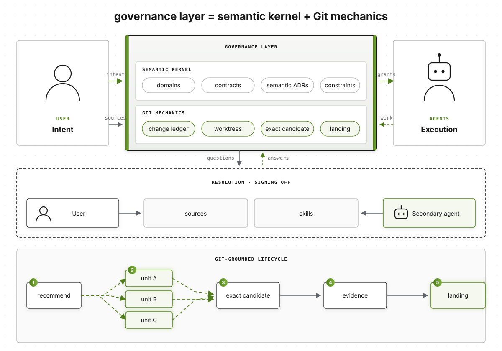

# Invariant

Invariant is a protocol for governing agentic work:

```text
governance layer = semantic kernel + Git-grounded lifecycle
```

The semantic kernel turns accepted repository meaning into closed consequences. The lifecycle binds
those consequences to exact Git objects, isolated work, evidence, and atomic integration. Harnesses
still choose models and run workers; Invariant decides what can be resolved or executed, on which
resource, and why.



## The boundary that matters

Most agent systems blur two independent questions:

1. Can this actor do something?
2. May this actor decide what the result should mean?

Invariant keeps them separate.

- **Execution capabilities** permit one operational consequence such as creating a worktree,
  running a verifier, converging a candidate, landing, or publishing.
- **Authority** begins with attributable **intent supply**. When accepted intent does not determine
  an answer, Invariant may issue one action-bound **resolution capability**.
- `intent.resolve` can be passed to a model for that exact question when policy delegates it. It
  supplies no shell, filesystem, ref, network, or publication access.
- Being able to execute never creates authority. Supplying intent never implies execution access.

That split lets a harness remain powerful without making its model's transcript the source of
repository truth.

## What the protocol grounds

Every change is one durable Git transaction:

```text
supplied intent
  -> accepted governance + compiled obligations
  -> Invariant recommendation + admissible frontier
  -> isolated attempts under scoped execution grants
  -> one causally converged candidate
  -> exact-tree evidence + scoped resolution when required
  -> single-use landing grant
  -> compare-and-swap local integration
  -> optional, separately granted publication
```

The change ledger lives at `refs/invariant/changes/<change>`. Attempt and aggregate candidate refs
keep work reachable after runtime deletion or process loss. Bearer tokens are returned once; only
their SHA-256 digests enter the ledger. A handoff capsule contains causal Git identities and no
model transcript or grant token.

Invariant reports authorization and containment independently. The current containment provider is
honestly `advisory`: the managed path enforces its grants, but Invariant does not claim a worker
cannot bypass it unless a future host proves that boundary.

## Quick start

Install from the repository:

```bash
uv tool install git+https://github.com/RenderBear/invariant-cli.git
```

Initialize an existing Git repository:

```bash
invariant init --defaults
git add .invariant/config.yml
git commit -m "Initialize Invariant"
```

The tracked policy makes authority and execution visibly distinct:

```yaml
version: 2
authority:
  intent:
    suppliers: [user]
  resolution:
    delegation: agent
execution:
  transitions: auto
integration_branch: auto
publication: off
parallelism:
  maximum: auto
```

Inspect it:

```bash
invariant status
invariant governance explain --path src/payments
```

## Harness integration

Start a local stdio MCP gateway bound to one repository:

```bash
invariant-mcp --repository /absolute/path/to/repository
```

The server constructs one `InvariantApplication` in-process. It exposes typed state, governance,
change, action, capability, work, candidate, landing, and publication operations. No tool accepts a
repository escape hatch, shell command, Git arguments, remote, credential, or arbitrary
environment.

A minimal operator flow looks like:

```bash
invariant change open checkout-copy \
  --intent "Correct the checkout button copy" \
  --supplier user:alice \
  --path web/checkout/button.tsx

invariant change recommend checkout-copy
invariant change inspect checkout-copy
```

The harness then requests the exact capabilities returned by the current state, performs work only
inside the created attempt worktree, submits a clean commit, converges it into the aggregate
candidate, captures compiled evidence, resolves any typed action, and requests a single-use landing
grant.

## Accepted governance

Tracked records are Git-versioned protocol-two values:

```text
.invariant/
├── config.yml
├── records/
│   ├── semantic/
│   ├── domain/
│   ├── contract/
│   └── constraint/
├── SOURCES.yml
├── sources/
├── audits/
└── discoveries/
```

Prose stays expressive. Only typed fields have protocol effects: context selection, capability
denial, required resolution, review, verification, serialization, parallel limits, containment,
ordering, invalidation, and landing blocks. This is the governing rule:

> Open semantics, closed consequences.

## Guarantees

On its governed path, Invariant provides:

- versioned and source-attributed semantic compilation;
- a bounded work frontier owned by the kernel, not injected by the harness;
- durable change, decision, grant, attempt, candidate, and action state in Git;
- actual-diff enforcement against unit claims;
- exact-tree evidence and review bindings;
- atomic compare-and-swap local landing with portable `Invariant-*` trailers; and
- publication off by default and bounded to the exact landing and existing upstream.

Invariant does not execute implementation workers, provide a generic shell, infer permission from
prose, authenticate identities a transport merely asserts, or claim containment it cannot prove.

## Read further

- [Protocol overview](protocol/README.md)
- [Normative protocol](protocol/protocol.md)
- [Implementation design](docs/SPEC.md)
- [CLI and MCP basics](docs/cli-basics.md)
- [Human model](protocol/model.html)
