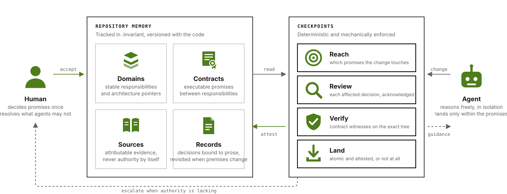

# Invariant protocol

The contract between a repository, the durable records it carries, and the agents that change it.
This folder defines the protocol; the reference CLI at
[RenderBear/invariant-cli](https://github.com/RenderBear/invariant-cli) implements it.

| File | What it is |
| --- | --- |
| [`protocol.md`](protocol.md) | The normative contract: tracked state, record envelopes, task lifecycle and actions, candidate verification and atomic landing, commit trailers, the JSON envelope, outcomes, and diagnostic codes. |
| [`model.html`](model.html) | The explanatory model for humans: what a record, evidence, and change are, who holds authority, and which guarantees hold. |

## The write side of intent

Most tooling helps an agent read a codebase better. Invariant stabilizes what an agent is allowed
to write back. The decisions, responsibilities, contracts, and sources a team has accepted live in
the repository, versioned with the code, and every consequential change passes checkpoints that
read them before it lands. The agent reasons freely; the checkpoints give it something exact to
reason against, and the landing writes its attestation back into the same memory.



## Ontology and authority

The public model has three nouns. A **Record** is accepted meaning that may govern future work.
**Evidence** is a grounded observation that may support or challenge a Record. A **Change** is one
managed repository change that produces Evidence and may propose Record changes.

```text
sources + audits + discoveries -> evidence -> explicit adoption -> records -> future changes
```

Evidence never becomes authority merely because an agent found or saved it. A human or authorized
agent adopts it through the repository's configured establishment policy. That separation lets an
agent investigate freely without silently turning an observation into a rule.

Records and their evidence are tracked in four thin registries over ordinary Markdown:

- **Domains** name stable responsibilities and point at the architecture prose that explains them.
- **Contracts** are executable promises between responsibilities, witnessed on the exact tree.
- **Decisions and constraints** are semantic records that bind accepted meaning to canonical prose
  and reopen when their premises change.
- **Sources** attach attributable external evidence to a domain, a contract, or the repository; a
  source is never authority by itself.

The Markdown remains the canonical explanation. Small YAML envelopes make its scope, reopening
conditions, verification, and supersession mechanically inspectable. The normative schemas and
authority rules are in [Records](protocol.md#2-records).

## Git-grounded mechanics

Invariant treats each Change as a Git transaction, not as a conversation transcript:

```text
receipt + isolated worktree -> implementation -> exact prospective tree
  -> reach + evidence -> review when required -> verification -> atomic local landing
```

The prospective tree is constructed without moving the integration ref. Evidence and any semantic
review are bound to that exact tree. Landing then uses a compare-and-swap against the captured head,
so a conflict, stale review, failed verifier, dirty integration checkout, or concurrent target move
leaves the target unchanged. The landed commit carries greppable `Invariant-*` trailers describing
scope, authority, governance, and review provenance. Publication is a separate, optional step; a
failed push does not undo a verified local landing. See [Verification and landing](protocol.md#4-verification-and-landing).

## Reach, contract risk, and safe parallelism

What teams often call **blast radius**, the protocol calls **reach**. A plan can estimate reach from
claimed paths, interfaces, domains, applicable records, and `provides`/`relies_on` relationships.
Before landing, Invariant recomputes it from the exact prospective tree and classifies it as
`local`, `bounded`, `open`, or `gated`.

A contract is an executable promise between responsibilities, not merely a nearby file. Contract
risk appears when a Change reaches or evolves that promise, changes something consumers rely on, or
fails an applicable verifier. Reach does not claim to prove semantic safety: broader or governed
effects require attributable review, while a failed verifier cannot be overridden by review.

That same dependency model determines safe parallelism:

- work with concrete, non-overlapping claims may proceed concurrently;
- consumers of an unchanged accepted contract may proceed concurrently;
- a changed contract has one provider, which must converge before dependent consumers begin; and
- the converged candidate is still reviewed, verified, and landed atomically as one Change.

This makes parallelization a consequence of explicit claims and contract causality, rather than a
guess based on directory boundaries. Plans and leases add temporary coordination; they do not change
the lifecycle or create authority. See [Coordination](protocol.md#5-coordination).

## Operating philosophy

1. free-form agent reasoning for accuracy;
2. deterministic, inspectable state where reasoning becomes consequential;
3. near-zero user ceremony for routine work; and
4. hard authority boundaries when an accepted promise is genuinely at risk.

## Versioning

The protocol is versioned by the `protocol` field of every JSON response. The current version is 1.
There is no negotiation and no compatibility layer: an implementation emits exactly one version, and a
consumer checks the field before parsing.

The CLI's own design of record, `docs/SPEC.md` in the CLI repository, describes commands, configuration,
runtime layout, and mechanics of that implementation. Where it and `protocol.md` disagree, the protocol
governs.

This folder is tracked inside the CLI repository under `protocol/` and published on its own at
[RenderBear/invariant-protocol](https://github.com/RenderBear/invariant-protocol) as a subtree.
